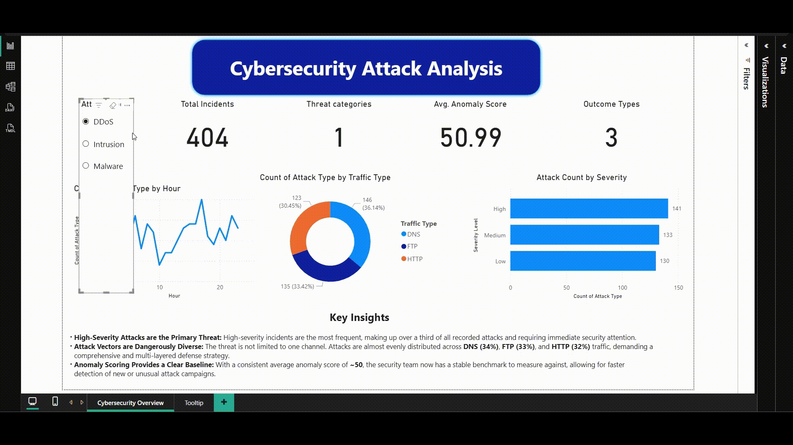

# Cybersecurity Attack Analysis Dashboard

## Live Demo 🎬

Below is a demonstration of the dashboard's interactive features, including the custom tooltip and slicer functionality.

---

## Project Overview 🎯

This project involved analyzing a cybersecurity dataset to identify key threat patterns and create a dynamic, interactive dashboard in Power BI. The goal was to provide a Security Operations team with a clear, at-a-glance overview of attack types, severity levels, and temporal trends to enable faster, data-driven decision-making.

---

## Data Source 📊

The dataset used for this analysis is the "Cyber Security Attacks" dataset, publicly available on Kaggle.

---

## Key Features & Insights 💡

* **Interactive Filtering:** The dashboard includes a slicer for `Attack Type`, allowing users to dynamically filter all visuals to isolate specific threats.
* **Detailed Tooltips:** Hovering over the `Severity Level` chart reveals a custom tooltip showing the breakdown of attack traffic types (DNS, FTP, HTTP) for that specific severity.
* **Key Insights:**
    * **High-Severity Attacks are the Primary Threat:** High-severity incidents are the most frequent, making up over a third of all recorded attacks and requiring immediate security attention.
    * **Attack Vectors are Dangerously Diverse:** The threat is not limited to one channel. Attacks are almost evenly distributed across DNS, FTP, and HTTP traffic, demanding a comprehensive defense strategy.
    * **Anomaly Scoring Provides a Clear Baseline:** With a consistent average anomaly score of ~50, the security team now has a stable benchmark for detecting new or unusual attack campaigns.

---

## Technical Skills Demonstrated 🛠️

* **Data Cleaning & Transformation (Power Query):** Handled missing values, standardized column names for clarity, and removed unused columns to optimize performance.
* **Data Modeling (Power BI):** Created new columns using DAX (`Day Name`, `Day Number`, `Hour`) to enable time-based analysis. Built a custom `Days` table to fix sorting issues.
* **Data Visualization & Reporting (Power BI):** Designed a clean, professional dashboard with appropriate visuals (KPI cards, donut chart, bar chart, line chart) to tell a clear story.
* **Advanced Features:** Implemented interactive slicers and a custom report-page tooltip to enhance user experience and provide deeper insights.

---

## How to Use This Repository 📁

You can download the full project file (`Cybersecurity_Attack_Analysis.pbix`) from this repository to explore the data model, DAX measures, and report design in Power BI Desktop.
